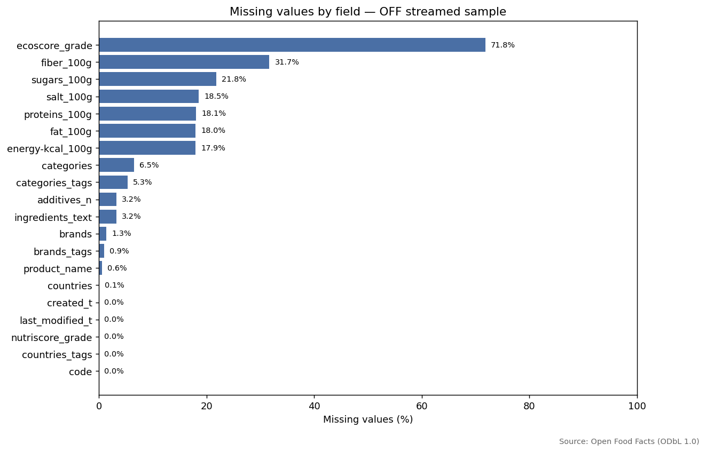
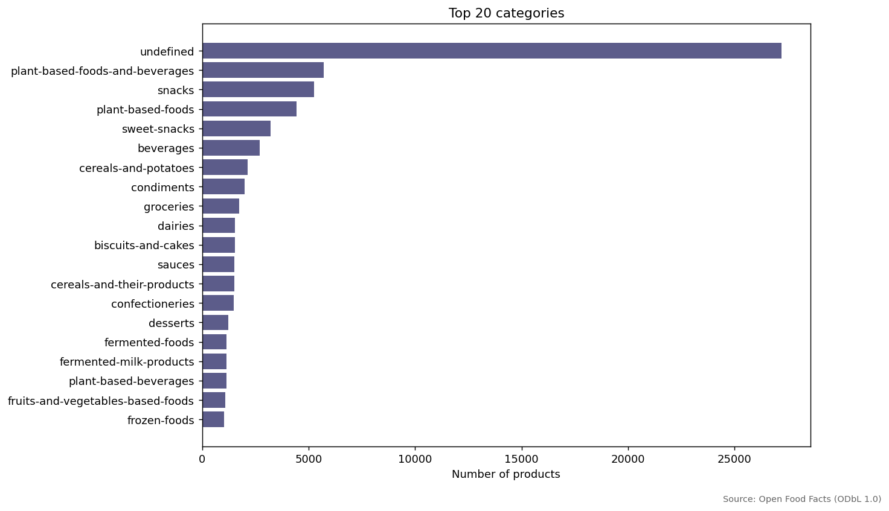
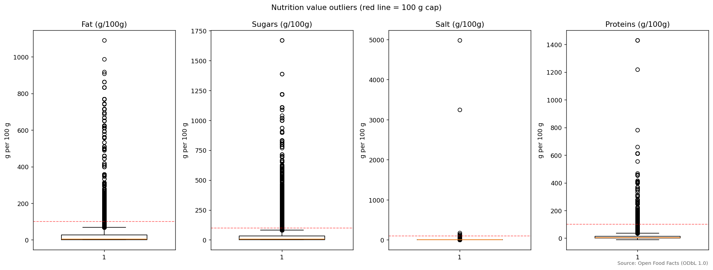
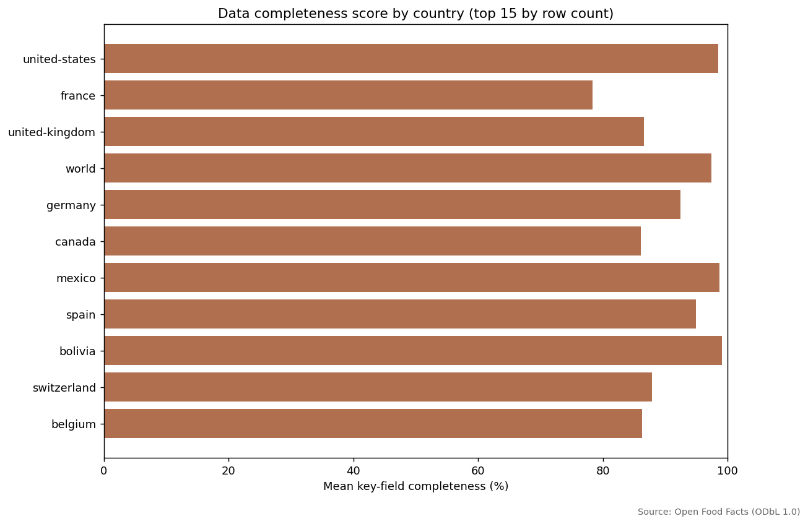

# Open Food Facts — Data Quality Case Study

[](https://github.com/MSeyyidDev/open-food-facts-data-quality-case-study/actions/workflows/ci.yml)
[](https://www.python.org/)
[](LICENSE)
[](https://opendatacommons.org/licenses/odbl/1-0/)

A realistic, end-to-end **data quality case study** on the public
[Open Food Facts](https://world.openfoodfacts.org/data) dataset. Demonstrates
how to deal honestly with a multi-gigabyte, contributor-edited, partially
broken open dataset:

- **Streaming ingest** of a >5 GB gzipped JSONL dump without ever fully
  downloading it.
- **DuckDB** for in-memory profiling and quality checks straight on the JSONL.
- **Pandas + Matplotlib** for figures and reports.
- **Pytest** for cleaning and validation rules.
- **GitHub Actions CI** running against a small committed sample (no network).

> **Note on licensing**: this repository's source code is MIT. The Open Food
> Facts dataset is released under the **Open Database License (ODbL) 1.0**.
> Anyone publishing a derivative database must keep the share-alike terms.
> See [`docs/data_dictionary.md`](docs/data_dictionary.md) for the
> attribution and details.

---

## Recruiter skim

| Item | Detail |
|---|---|
| Dataset | Open Food Facts public product catalog |
| Scope | Streamed JSONL sample from a >5 GB compressed dump plus committed sample for CI |
| Tools | DuckDB, streaming gzip/JSONL, Python, Pandas, Matplotlib, pytest |
| Main signal | Memory-safe ingest plus completeness and plausibility checks |
| Best artifacts | [`src/download_data.py`](src/download_data.py), [`sql/quality_checks.sql`](sql/quality_checks.sql), [`reports/data_quality_report.md`](reports/data_quality_report.md), [`reports/figures/`](reports/figures/) |

---

## Streaming strategy (no full download)

The OFF dump is a single gzipped JSON-Lines file well over 5 GB compressed.
This project never downloads it whole. Instead:

```
HTTP GET (stream=True) ──► response.raw ──► gzip.GzipFile ──► json.loads(line)
                                                  │
                                                  ▼
                                       stop after --limit records
```

`src/download_data.py` opens an HTTP stream and decodes the gzip
incrementally, line by line, then writes the first `N` decoded JSON records
(default 50,000) to `data/raw/openfoodfacts_sample.jsonl`. As soon as the
record budget is hit, the iterator returns and the connection is torn down.

Memory footprint is bounded by the gzip window plus a single decoded line —
no matter how big the source dump is.

```bash
python src/download_data.py --limit 50000
python src/download_data.py --limit 5000 --out data/raw/smoke.jsonl
```

> **Honest disclaimer**: The streamed prefix is **not a uniform random
> sample**. The OFF dump is roughly insertion-time-ordered, so our prefix
> is biased toward earlier records. All findings in this report apply to
> "the streamed prefix", not the global OFF catalog. See
> [`docs/assumptions_and_limitations.md`](docs/assumptions_and_limitations.md).

---

## Pipeline at a glance

```
download_data.py  ─►  data/raw/*.jsonl  ─►  profile_data.py  ─►  data/processed/profile.json
                                       └─►  generate_figures.py  ─►  reports/figures/*.png
                                       └─►  generate_report.py    ─►  reports/data_quality_report.md
```

DuckDB reads the streamed JSONL directly via `read_json_auto()`. The same
quality-check SQL queries that drive the report also drive the unit tests
in `tests/test_validation.py`.

---

## Quickstart

```bash
git clone https://github.com/MSeyyidDev/open-food-facts-data-quality-case-study.git
cd open-food-facts-data-quality-case-study

python -m venv .venv
# Windows: .venv\Scripts\activate
# Unix:    source .venv/bin/activate

pip install -r requirements.txt

# 1. Stream a sample (network needed once)
python -m src.download_data --limit 50000

# 2. Profile
python -m src.profile_data data/raw/openfoodfacts_sample.jsonl

# 3. Figures
python -m src.generate_figures data/raw/openfoodfacts_sample.jsonl

# 4. Report
python -m src.generate_report data/raw/openfoodfacts_sample.jsonl

# 5. Tests (works offline against committed sample)
pytest -v
```

---

## What's checked (data quality rules)

`sql/quality_checks.sql` defines 16 named checks. The same logic exists in
Python in `src/validate_data.py` for unit testing. Highlights:

| Rule                          | Description                                           |
|-------------------------------|-------------------------------------------------------|
| `qc_missing_product_name`     | `product_name` empty or null.                         |
| `qc_missing_brand`            | `brands` empty or null.                               |
| `qc_missing_country`          | Both `countries` and `countries_tags` missing.        |
| `qc_missing_categories`       | Same for categories.                                  |
| `qc_missing_nutrition_block`  | All nutrient-100g fields null.                        |
| `qc_invalid_barcode_length`   | `code` length not in {8, 12, 13, 14}.                 |
| `qc_implausible_energy`       | `energy-kcal_100g > 900`.                             |
| `qc_implausible_fat/sugars/salt/proteins` | Any macro > 100 g per 100 g.              |
| `qc_negative_nutrition_values`| Any nutrient < 0.                                     |
| `qc_duplicate_barcodes`       | Same canonical barcode appearing more than once.      |
| `qc_invalid_country_tag`      | Country tag not language-prefixed (`en:`).            |
| `qc_unparseable_dates`        | `last_modified_t` / `created_t` not parseable as int. |

`sql/analysis_queries.sql` adds 12 named analytics queries — top brands,
top categories, completeness scores by country and category, additives
distribution, year-over-year additions, etc.

---

## Figures (selected)









The full set lives in [`reports/figures/`](reports/figures/) and the
narrative report (with real numbers from the run) is in
[`reports/data_quality_report.md`](reports/data_quality_report.md).

---

## Repository layout

```
.
├── README.md
├── LICENSE                     # MIT for code; data is ODbL
├── requirements.txt
├── pyproject.toml
├── data/
│   ├── raw/                    # streamed JSONL (gitignored)
│   ├── processed/              # profile JSON, parquet (gitignored)
│   └── sample/                 # committed 2k-record sample for tests
├── reports/
│   ├── data_quality_report.md
│   └── figures/                # 7 PNGs
├── notebooks/
│   └── 01_exploratory_analysis.ipynb
├── src/
│   ├── download_data.py        # streaming gzip+JSONL ingest
│   ├── profile_data.py         # DuckDB + Pandas profile
│   ├── clean_data.py           # whitespace, country, barcode, name
│   ├── validate_data.py        # rule list (mirrors quality_checks.sql)
│   ├── generate_figures.py     # 7 PNGs
│   ├── generate_report.py      # builds reports/data_quality_report.md
│   └── db.py                   # DuckDB helpers, read_json_auto view
├── sql/
│   ├── create_tables.sql
│   ├── quality_checks.sql      # 16 named checks
│   └── analysis_queries.sql    # 12 named analyses
├── docs/
│   ├── data_dictionary.md
│   ├── cleaning_decisions.md
│   ├── assumptions_and_limitations.md
│   └── methodology.md
├── tests/
│   └── test_validation.py
└── .github/workflows/ci.yml    # 3.11 + 3.12 matrix
```

---

## Why this project

Real-world public datasets are messy. Doing a credible analysis on Open
Food Facts means picking a sane sampling strategy, *not* loading the
entire 5 GB dump on a developer laptop, validating against physical
plausibility caps, and being explicit about what the numbers do and do
not represent.

This repo is a portfolio piece showing exactly that workflow:
streaming + DuckDB + reproducible quality checks + honest documentation.

---

## License

- **Code**: MIT (`LICENSE`).
- **Data**: ODbL 1.0 — see [`docs/data_dictionary.md`](docs/data_dictionary.md).

> Open Food Facts attribution: "© Open Food Facts contributors —
> https://world.openfoodfacts.org — licensed under ODbL 1.0."
