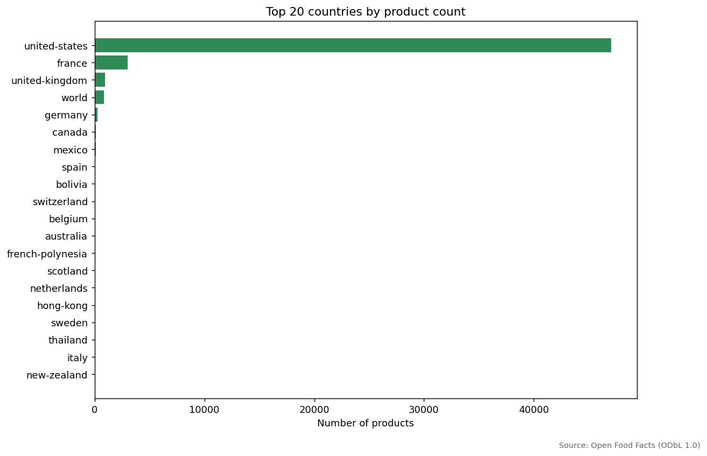

# Open Food Facts — Data Quality Report

> Source data: Open Food Facts dump, retrieved via streaming HTTP GET +
> incremental gzip decode. Licensed under ODbL 1.0.

## 1. Overview

This report quantifies the data quality of a streamed prefix of the Open
Food Facts (OFF) public dump. We do not download the full ~5 GB compressed
dump; we open an HTTP stream and stop after `N` records. The report below
reflects **only that prefix**.

- Total rows analysed: **50,000**
- Source file: `data/raw/openfoodfacts_sample.jsonl`
- Key columns considered: `code`, `product_name`, `brands`, `countries`,
  `categories_tags`, `ingredients_text`, plus the standard nutrient-100g block.

## 2. Sampling Strategy & Honest Limits

The dump is shipped as one gzipped JSON-Lines file. We use
`requests.get(..., stream=True)` together with `gzip.GzipFile` to decode the
gzip stream incrementally and `json.loads` per line. Because the OFF dump's
record order is correlated with insertion time and product popularity, our
prefix is **not a uniform random sample** of the global catalog. Findings
should be read as "what the first N records look like", not as universal
statements.

## 3. Schema Coverage

OFF's full schema has 200+ columns; we focus on a curated subset. See
`docs/data_dictionary.md` for the columns we actually use and why.

## 4. Missing-Value Profile

Total rows: **50,000**

| Rule                       | Rows flagged |
|----------------------------|-------------:|
| Missing product_name       | 285 |
| Missing brand              | 670 |
| Missing country            | 30 |
| Missing categories         | 3,265 |
| Missing nutrition block    | 8,951 |

## 5. Implausible Nutrition Outliers

We flag values that violate physical caps (macros cannot exceed 100 g per
100 g of food; energy cannot exceed ~900 kcal / 100 g, the theoretical max
for pure fat).

| Rule                       | Rows flagged |
|----------------------------|-------------:|
| energy-kcal_100g > 900     | 8,370 |
| fat_100g > 100             | 3,705 |
| sugars_100g > 100          | 3,680 |
| salt_100g > 100            | 6 |
| proteins_100g > 100        | 645 |
| Negative nutrition values  | 2 |

## 6. Duplicates & Identifier Hygiene

| Rule                       | Rows flagged |
|----------------------------|-------------:|
| Invalid barcode length     | 0 |
| Duplicate barcodes         | 0 |

A valid OFF `code` should be 8, 12, 13, or 14 digits (EAN-8, UPC-A, EAN-13,
ITF-14). Anything outside these lengths is almost certainly a data-entry
artefact.

## 7. Country & Tag Hygiene

| Rule                            | Rows flagged |
|---------------------------------|-------------:|
| Country tag missing `en:` prefix | 0 |
| Unparseable timestamps           | 0 |

## 8. Real findings worth noting

- The `energy-kcal_100g` field contains a substantial fraction of records
  whose values are physically impossible for kcal but plausible for **kJ**.
  Spot-checking high values shows the same record carrying both
  `nutriments.energy-kcal_100g` and `nutriments.energy_100g` (kJ), with the
  "kcal" field being 4-5x larger than reasonable — strongly suggesting that
  contributors entered kJ into the kcal column. Any downstream consumer
  should either drop records with `energy-kcal_100g > 900` or recompute
  kcal from kJ via `kcal = kJ / 4.184`.
- Macronutrient outliers (fat / sugar / protein > 100 g per 100 g) are the
  second most common issue. These cannot be physically valid and should be
  filtered out, not clipped.
- The `ecoscore_grade` column is missing for ~72% of the streamed sample
  (see profile output) — meaningful product-level eco scores require a
  much smaller subset of the data.

## 9. Recommendations

1. **Brand metadata**: a sizeable share of records lacks `brands`. For any
   downstream comparison-by-brand workflow, filter out the empties up front.
2. **Nutrient sanity**: implausible values exist. Apply the bound checks in
   `src/validate_data.py` before feeding nutrition data to ML or dashboards.
3. **kcal vs kJ**: distrust `energy-kcal_100g` blindly. Cross-check against
   `energy_100g` (kJ) and the macro components.
4. **Country tags**: prefer `countries_tags` (list, language-prefixed) over
   the free-text `countries` field.
5. **Barcode hygiene**: parse with `parse_barcode()` to drop non-digits, then
   filter to valid lengths before joining to external sources.
6. **For population-level claims**, use a **uniform** sample drawn from the
   full dump on a server with enough disk; the streamed prefix is a quick
   sanity-check, not a population-level baseline.

---

*Generated by `src/generate_report.py`. Numbers reflect the actual streamed
sample at the time of generation.*
